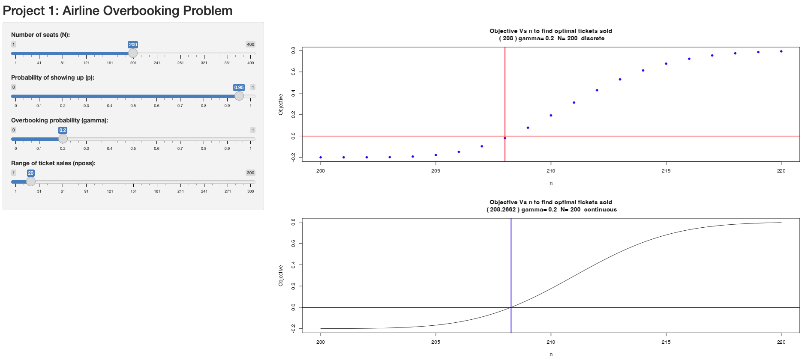

# ✈️ Airline Overbooking Problem – R Shiny App

This project models the classic airline overbooking dilemma using probability theory and optimization. The goal is to help airlines decide how many tickets to sell for a flight given:

- Number of available seats
- Probability that a passenger shows up
- Acceptable overbooking risk

## 🔧 Built With
- R
- Shiny
- Binomial probability models
- Optimization (discrete & continuous)

## 📊 Features
- Interactive sliders to control:
  - Number of seats
  - Show-up probability
  - Overbooking tolerance (gamma)
  - Ticket sale range
- Visualizes objective functions to find optimal number of tickets sold
- Discrete vs. continuous modeling comparison

## 🌐 Live Demo  
👉 [Click here to try the interactive app](https://rmsmind.shinyapps.io/airline-overbooking/)

## 🖼 Screenshot

## 📁 Files Included
- `app.R` – the full interactive Shiny app
- `Project-1---Airline-Overbooking-Problem.html` – knitted summary
- `Project 1 - Airline Overbooking Problem.Rmd` – theory, code, and write-up
- `AirlineOverbooking.png` – screenshot preview

---

📌 *Created by Jorge Juarez – M.S. Applied Statistics Student @ University of Oklahoma*
